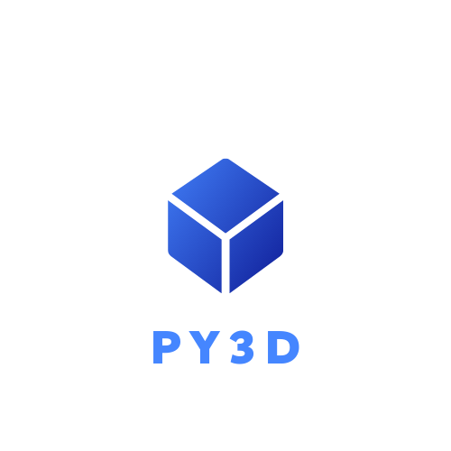

    
    <h4> Py3D is a 3d rendering engine written entirely in python. </h4>
    <h4> It is a simple and easy to use 3d engine. </h4>

    <h2>🚧🚧🚧 WARNING 🚧🚧🚧</h2>
    <h4> This is a beta version of Py3D, and is currently under development. It has a lot of bugs right now, and cannot be used to make something big just yet. </h4>

